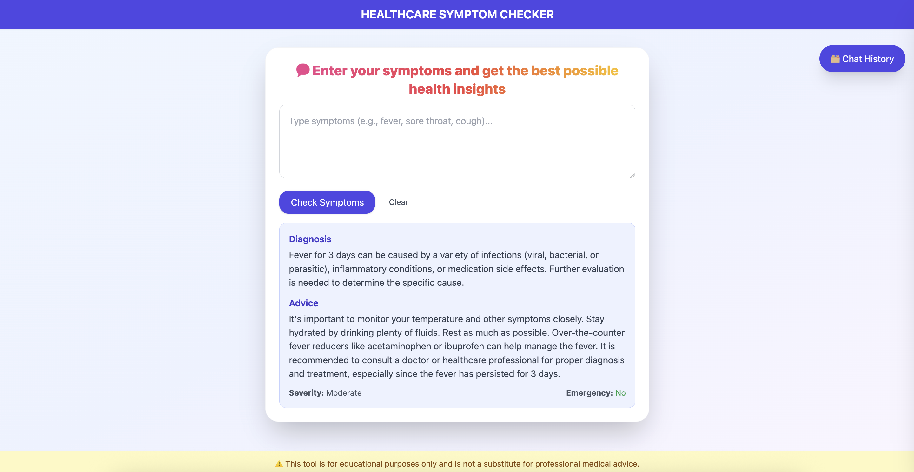
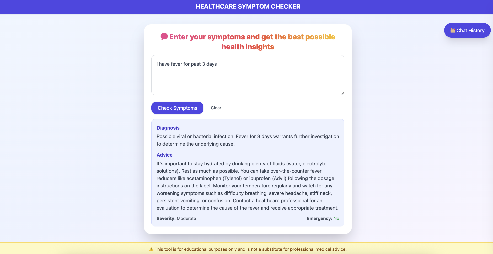
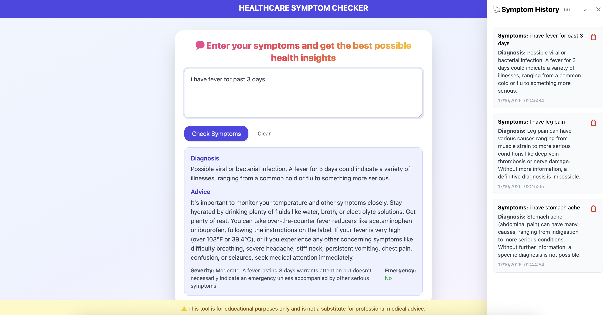
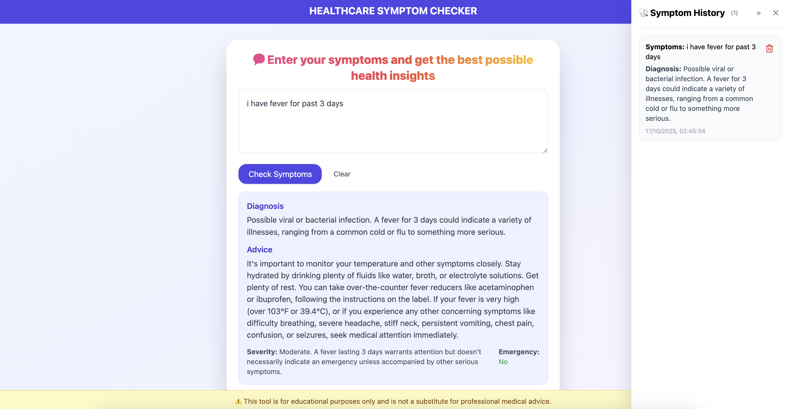

# Healthcare Symptom Checker

An **AI-powered web application** that helps users check their symptoms and get possible health conditions with safe, educational recommendations.

---

## Overview

The **Healthcare Symptom Checker** allows users to input their symptoms in plain language and instantly receive **AI-generated analyses** of possible conditions along with **recommended next steps**.  
The system integrates a **React + Tailwind CSS frontend** with a **Node.js + Express backend** powered by **Google Gemini AI** and stores chat history in a **MongoDB database**.

---

## Objective

- Allow users to input symptoms in natural language.  
- Generate probable health conditions and suggested next steps.  
- Maintain a searchable and deletable history of all symptom checks.  
- Provide a user-friendly interface with a responsive sidebar for chat history.

---

## Features

- Real-time symptom analysis using **Google Gemini AI**.  
- Displays **diagnosis, advice, severity, and emergency indicator**.  
- Stores user queries and AI responses in **MongoDB**.  
- Interactive and responsive frontend built with **React** and **Tailwind CSS**.  
- **Sidebar** for chat history with individual delete options.  
- **Educational disclaimer** fixed at the bottom of the screen.  

---

## Tools and Technologies Used

| Layer | Tools / Libraries |
|-------|--------------------|
| Frontend | React, Tailwind CSS, Lucide-React (icons) |
| Backend | Node.js, Express.js |
| Database | MongoDB (Mongoose) |
| AI / LLM | Google Gemini AI (gemini-2.0-flash model) |
| Others | dotenv, cors, axios, body-parser |

---

## Backend Details

The backend is built using **Node.js** and **Express**, handling API requests, AI integration, and MongoDB data storage.

### index.js
- Entry point for the server.  
- Handles routes for symptom check and history retrieval.  
- Integrates Google Gemini API for AI-driven responses.  
- Stores and retrieves chat history from MongoDB using Mongoose.  

### Database Model
- Defines the `SymptomHistory` schema to store:
  - Symptoms entered by the user  
  - AI-generated diagnosis, advice, severity, and emergency flag  
  - Timestamp for each query  

---

## Frontend Details

### App.jsx
- Main React component handling:
  - User input for symptoms  
  - Fetching AI-generated analysis from backend  
  - Displaying diagnosis and advice in a styled chat interface  
  - Chat history sidebar toggle  
  - Delete functionality for each history entry  
  - Fixed caution box for medical disclaimer  

### UI Features
- Responsive layout with gradient background.  
- Right-side sidebar for history with red delete icons.  
- “Show History” button positioned on the top-right corner.  
- Educational disclaimer box fixed at the bottom of the page.  
- Modern and clean typography using Tailwind CSS.  

---

## Database Information
The Healthcare Symptom Checker uses MySQL as its primary database to store and manage user interactions and chat history efficiently.

 ### Key Features:
	- Stores user symptom queries and AI-generated responses.
	- Maintains timestamps for each conversation for tracking and analysis.
	- Ensures data persistence even after the server restarts.
	- Uses secure environment variables (.env) to manage database credentials.

## Output Screenshots

## Screenshots

### 🏠 Home Page

### 💬 Chat Interface

### 📜 Chat History

### 📜 close
